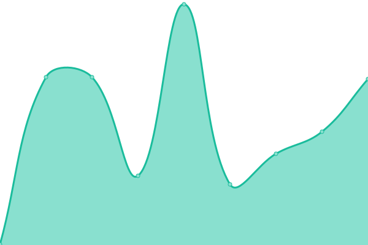

# [📈 Live Status](https://status.matsevh.be): <!--live status--> **🟩 All systems operational**

This repository contains the open-source uptime monitor and status page for [MatseVH](https://jeugdwerk.org), powered by [Upptime](https://github.com/upptime/upptime).

With [Upptime](https://upptime.js.org), you can get your own unlimited and free uptime monitor and status page, powered entirely by a GitHub repository. We use [Issues](https://github.com/matse2005/uptime/issues) as incident reports, [Actions](https://github.com/matse2005/uptime/actions) as uptime monitors, and [Pages](https://status.matsevh.be) for the status page.

<!--start: status pages-->
<!-- This summary is generated by Upptime (https://github.com/upptime/upptime) -->
<!-- Do not edit this manually, your changes will be overwritten -->
<!-- prettier-ignore -->
| URL | Status | History | Response Time | Uptime |
| --- | ------ | ------- | ------------- | ------ |
|  [Jeugdwerk](https://jeugdwerk.org) | 🟩 Up | [jeugdwerk.yml](https://github.com/Matse2005/uptime/commits/HEAD/history/jeugdwerk.yml) | 

 827ms
     
 | 

<a href="https://status.matsevh.be/history/jeugdwerk">100.00%</a>
    

|  [Jeugdwerk Images](https://jeugdwerk.org) | 🟩 Up | [jeugdwerk-images.yml](https://github.com/Matse2005/uptime/commits/HEAD/history/jeugdwerk-images.yml) | 

 201ms
     
 | 

<a href="https://status.matsevh.be/history/jeugdwerk-images">100.00%</a>
    

|  [Jeugdwerk Tools](https://tools.jeugdwerk.org) | 🟩 Up | [jeugdwerk-tools.yml](https://github.com/Matse2005/uptime/commits/HEAD/history/jeugdwerk-tools.yml) | 

 343ms
     
 | 

<a href="https://status.matsevh.be/history/jeugdwerk-tools">100.00%</a>
    

|  [Jeugdwerk Badges](https://badges.jeugdwerk.org) | 🟩 Up | [jeugdwerk-badges.yml](https://github.com/Matse2005/uptime/commits/HEAD/history/jeugdwerk-badges.yml) | 

 218ms
     
 | 

<a href="https://status.matsevh.be/history/jeugdwerk-badges">100.00%</a>
    

|  [Jeugdwerk Stratego](https://stratego.jeugdwerk.org) | 🟩 Up | [jeugdwerk-stratego.yml](https://github.com/Matse2005/uptime/commits/HEAD/history/jeugdwerk-stratego.yml) | 

 170ms
     
 | 

<a href="https://status.matsevh.be/history/jeugdwerk-stratego">100.00%</a>
    

|  [Jonas Roets](https://jonasroets.be) | 🟩 Up | [jonas-roets.yml](https://github.com/Matse2005/uptime/commits/HEAD/history/jonas-roets.yml) | 

 754ms
     
 | 

<a href="https://status.matsevh.be/history/jonas-roets">100.00%</a>
    

<!--end: status pages-->

[**Visit our status website →**](https://status.matsevh.be)

## 📄 License

- Powered by: [Upptime](https://github.com/upptime/upptime)
- Code: [MIT](./LICENSE) © [Anand Chowdhary](https://anandchowdhary.com), supported by [Pabio](https://pabio.com)
- Data in the `./history` directory: [Open Database License](https://opendatacommons.org/licenses/odbl/1-0/)
